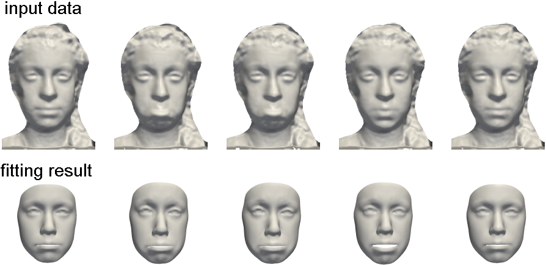

## Multilinear Face Model Fitting

The provided program loads a multilinear face model described in the [scientific publication (CVIU 2015)](https://drive.google.com/open?id=1hM1RvmYhj-Rdp6WYgbsLzaWQSvg2jgFf) and fits this model to a point cloud or a triangle mesh.

<p align="center"> 

</p>

### Setup

The provided code has dependencies on the following libraries:
* Insight Segmentation and Registration Toolkit ITK (http://www.itk.org/). We recommend using ITK 4.50.
* Clapack (http://www.netlib.org/clapack/). Clapack must be compiled using Blas (USE BLAS WRAP must be enabled when using CMake). We recommend using Clapac 3.2.1.
* Approximate Nearest Neighbor Library ANN (http://www.cs.umd.edu/ mount/ANN/). We recommend using ANN 1.1.2.

To setup the provided code, use CMake and specify the required ITK, Clapack and ANN paths. Successfully compiling the project outputs a MM_Restricted.exe.

### Basic usage

To run the program, the MM_Restricted.exe must be called with following 6 parameters, separated by a blank.
* Model.rmm - full path of the used multilinear model. This parameter should point to the All 30 7.rmm.
* templateMesh.off - full path of the training data template mesh, needed for the mesh structure of the result. This parameter should point to the MeanFace.off.
* templateLmks.txt - full path of a text file including the landmark (x y z)-coordinates of the template mesh, the first 8 landmarks are used to compute a rigid alignment. This parameter should point to the All_Lmks.txt.
* targetData.off - full path of the fitting target point cloud or triangle mesh.
* targetLmks.txt - full path of a text file including the landmark (x y z)-coordinates of the target face mesh, the first 8 landmarks are used to compute the rigid alignment.
* outFitting.off - full path of the fitting result file.

##### Landmarks

<p align="center"> 

</p>
Figure: Suggested landmarks. Red: Landmarks used for rigid alignment computation and fitting. Blue: Landmarks used just for fitting.

The landmark files contain the concatenated (x y z)-coordinates of 13 specified landmarks, all coordinates separated by a line break. The first 8 landmarks are used to compute a rigid alignment between the target data and the local coordinate system of the model. The red landmarks in the figure are recommended, since
they are relatively invariant to expression changes. Furthermore, all specified landmarks are used while model fitting.

##### Target data

The target data need to be provided in an OFF-file format. Point clouds and triangle meshes are supported.

### Example

The example RegisterTestMM.cmd fits the multilinear model to a point cloud named stereo pointcloud.off with specified landmarks stereo pointcloud landmarks.txt and outputs the fitted mesh as OFF-file named stereo pointcloud fitting.off. To run the example, all paths within the RegisterTestMM.cmd must be adjusted
to point to the specified files. By exchanging the parameters of the target data, target landmarks and output fitting file name, this can be used to fit any other target OFF-file.

### Possible extensions

In the case of partial facial occlusions it might be necessary to use a different set of landmarks. To change the set of landmarks, the same set of points need to be specified for the templateMesh and the targetData and the points need to be in the same order. To change the influence of landmarks while fitting, the parameter PROJECTION LMK WEIGHT at Definitions.h can be changed.

To load other file formats than OFF, the FileLoader class needs to be extended by a loader for the specific file format, that edits the input DataContainer by the loaded data.

The proposed fitting can easily be extended to fit motion sequences like described in the [paper](https://drive.google.com/open?id=1hM1RvmYhj-Rdp6WYgbsLzaWQSvg2jgFf). For this, the fitting can be used for initialization and an extended energy for the entire sequence must be added.

### License

The source is provided for NON-COMMERCIAL RESEARCH PURPOSES only, and is provided as is WITHOUT ANY WARRANTY; without even the implied warranty of fitness for a particular purpose. The redistribution of the code is not permitted.


### Citing

When using this code in a scientific publication, please cite 
```
@article{BolkartWuhrer2015_CVIU,
  title = {{3D} faces in motion: Fully automatic registration and statistical analysis},
  author = {Bolkart, Timo and Wuhrer, Stefanie},
  journal={Computer Vision and Image Understanding},
  volume={131},
  pages={100--115},
  year={2015}
}
```


